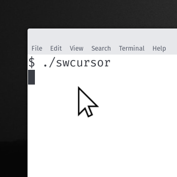

# swcursor



This is a simple software cursor for X11 environments,
it creates an overlay window with an (large) image that
follows the cursor around. You will need to arrange
for your normal cursor to be hidden, or screen record
using ffmpeg `kmsgrab` which often does not capture
harware cursors at all.

This is largely for screen recording where you would like
a very large cursor that visually hilights when you click,
Also when screen recording directly from the KMS scanout
buffer using `kmsgrab` with ffmpeg, hardware cursors won't
show up, so running this program you get a nice large
cursor.


## Installation and Usage

You will need to have working development libraries for gtk-3.0,
gdk and xlib.

```
$ make
$ ./swcursor
```


## Implementation

It's suprisingly difficult to find documentation on the interaction
between GTK, GDK and X11 and there are some pitfalls, this is
a reasonably minimal example of creating a GTK window and then
manipulating it with lower level commands from GDK and Xlib.
The two non-trivial things are making the window transparent,
and removing all decoration. The X11 shape extension is used
to make the winow click-through.
